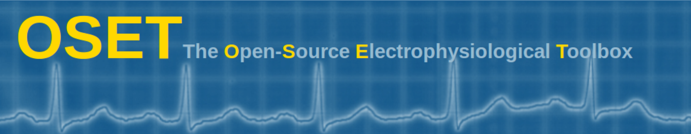

# The Open-Source Electrophysiological Toolbox

## INTRODUCTION

OSET is a collection of electrophysiological data and open source codes for biological signal generation, modeling, processing, and filtering, originally released in June 2006. The toolbox is distributed under the BSD License and may be freely used or modified under the specified terms of use. The source codes have been mainly developed in MATLAB and partially in C++; but contributions in other languages are welcome. Please feel free to contact us in case of any comments or questions.
Starting from Version 3.14 released on June 2018, OSET is accessible and will be updated on GitHub: [https://github.com/alphanumericslab/OSET.git](https://github.com/alphanumericslab/OSET.git)

**December 2023:** *OSET is under reorganization and documentation, but will remain backward compatible.*

## INSTALLATION
1. Clone the repository on your computer

1. Add the main folder and its subfolders to your MATLAB path

1. Start working with the toolbox!

**NOTES:**

1. The source codes and folder structures may change. Please rememeber to update your MATLAB path upon each update

1. The C and C++ MEX-files neeed to be recompiled on your system. Make sure that you recompile them if you use them in your codes

## CODE OF CONDUCT
Refer to [Code of conduct, diversity, equity, and inclusion statement](./code-of-conduct/).

## HISTORY
* Version 1.0 (June 2006): Initial release
* Version 2.0 (May 2008): Updated with source separation algorithms
* Version 3.0 (September 2012): Fetal ECG data and source codes for fetal ECG extraction added
* Version 3.14 (June 2018): Git repository public release
* Version 4.0 (December 2023): OSET codebase revision initiated

## CITATION
Please cite OSET as follows: R. Sameni, OSET: The open-source electrophysiological toolbox. Version 3.14, URL: [https://github.com/alphanumericslab/OSET.git](https://github.com/alphanumericslab/OSET.git)

## CONTACT
- Reza Sameni, Emory University Department of Biomedical Informatics. Web: [https://sameni.info](https://sameni.info)
- [The Alphanumerics Lab](https://sameni.org)
